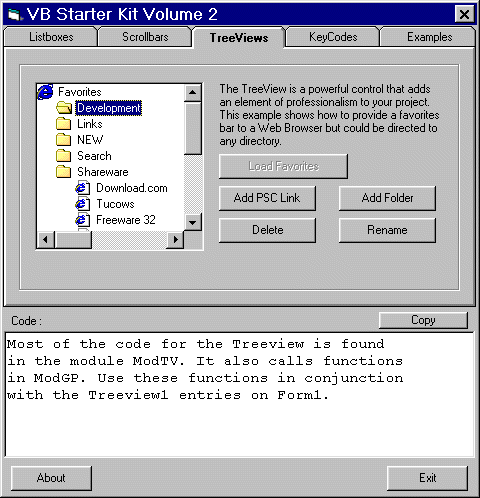



## Beginners Toolbox \- Volume 2

### Description

In response to requests for more samples here is Volume 2. This collection includes the use of scrollbars, listboxes and the treeview.

Move listitems up or down in a listbox, remove duplicates etc. The treeview example demonstrates a fully functioning 'Favorites bar' for

a Web browser application using Internet explorers favorites - add links, add new folders, rename, delete etc. Also included is a KeyCode giver, a picture resizer, and just for fun a random mousemover.

Code for each function appear in a textbox ready to copy into your project. I hope this is of some help to people beginning VB. Good luck.
 
### More Info
 

             |
---                |---
**Submitted On**   |2001-03-05 01:15:46
**By**             |[MrBobo](https://github.com/Planet-Source-Code/PSCIndex/blob/master/ByAuthor/mrbobo.md)
**Level**          |Beginner
**User Rating**    |4.8 (58 globes from 12 users)
**Compatibility**  |VB 6\.0
**Category**       |[Miscellaneous](https://github.com/Planet-Source-Code/PSCIndex/blob/master/ByCategory/miscellaneous__1-1.md)
**World**          |[Visual Basic](https://github.com/Planet-Source-Code/PSCIndex/blob/master/ByWorld/visual-basic.md)
**Archive File**   |[CODE\_UPLOAD15887342001\.zip](https://github.com/Planet-Source-Code/mrbobo-beginners-toolbox-volume-2__1-21503/archive/master.zip)

